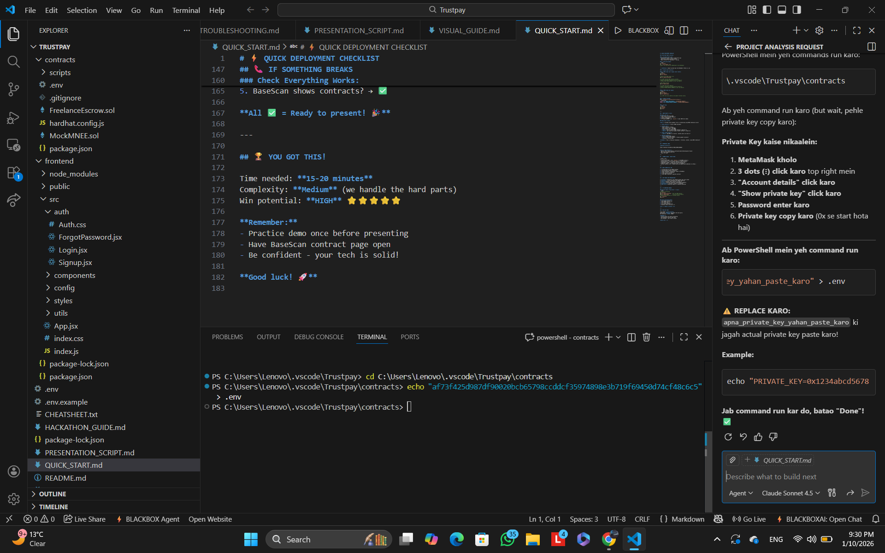

# ⚡ QUICK DEPLOYMENT CHECKLIST

## 🚨 DO THIS FIRST (10 mins)

### 1. Get Base ETH for Gas
- Bridge ETH to Base: https://bridge.base.org/
- OR use Base Sepolia testnet faucet
- Need ~$5 worth for deployment + testing

### 2. Setup Environment
```bash
cd contracts
cp ../.env.example .env
# Edit .env and add your PRIVATE_KEY (from MetaMask)
```

⚠️ **CRITICAL:** Export private key from MetaMask → Paste in .env

### 3. Deploy Smart Contracts

#### If MNEE token has 0 supply (most likely):
```bash
npm install
npm run compile

# Deploy mock MNEE token first
npm run deploy:mockToken

# 📝 COPY the Mock MNEE address printed!
# Update frontend/src/config/contract-config.js:
# Change MNEE_TOKEN_ADDRESS to your new address

# Now deploy escrow
npm run deploy:base

# 📝 COPY the Escrow address!
# Update frontend/src/config/contract-config.js:
# Change ESCROW_CONTRACT_ADDRESS to your new address
```

#### If MNEE token has supply:
```bash
npm install
npm run compile
npm run deploy:base

# 📝 COPY the Escrow address and update frontend config
```

### 4. Update Frontend
Edit `frontend/src/config/contract-config.js`:
```javascript
export const MNEE_TOKEN_ADDRESS = "0xYOUR_MNEE_ADDRESS";
export const ESCROW_CONTRACT_ADDRESS = "0xYOUR_ESCROW_ADDRESS";
```

### 5. Run App
```bash
cd frontend
npm install
npm start
```

---

## 🎬 DEMO SCRIPT (3 mins)

### Setup (30 sec)
1. Open http://localhost:3000
2. Click "Connect to Base Network"
3. Approve in MetaMask
4. If using MockMNEE, call `faucet()` to get 1000 test tokens

### Demo Flow (2 mins)

**SAY:** "TrustPay solves payment trust in freelancing using MNEE stablecoin escrow"

1. **Show balance:** "I have X MNEE available"
   
2. **Create job:** 
   - Enter freelancer address
   - Enter amount (e.g., 100 MNEE)
   - Click "Create Job & Lock MNEE"
   - **SAY:** "First I approve MNEE spending" (approve tx)
   - **SAY:** "Now funds are locked in smart contract" (create tx)

3. **Show locked status:**
   - **SAY:** "100 MNEE is in escrow - neither party can touch it"

4. **Release payment:**
   - Click "Release MNEE Payment"
   - **SAY:** "Once work is done, I release payment instantly"
   - Freelancer receives MNEE

**CLOSING:** "This is Financial Automation - trustless, instant, using MNEE stablecoin"

---

## 🔗 IMPORTANT LINKS

**BaseScan Contract:**
```
https://basescan.org/address/YOUR_ESCROW_ADDRESS
```

**Test on Base Sepolia:**
- Faucet: https://www.coinbase.com/faucets/base-ethereum-goerli-faucet
- RPC: https://sepolia.base.org
- Chain ID: 84532

---

## ⚠️ COMMON ISSUES - QUICK FIXES

| Issue | Fix |
|-------|-----|
| "Insufficient MNEE" | Call `faucet()` on MockMNEE contract |
| "Wrong network" | Click connect button, it auto-switches |
| "Deployment failed" | Check you have Base ETH for gas |
| "Approval failed" | Increase gas limit in MetaMask |
| Contract address error | Double-check you updated both addresses in config |

---

## 📊 WHAT JUDGES WILL SEE

1. ✅ Professional UI with MNEE branding
2. ✅ Working Base network connection
3. ✅ Real blockchain transactions (shown in MetaMask)
4. ✅ Smart contract on BaseScan
5. ✅ Clear escrow workflow
6. ✅ Uses MNEE stablecoin (required contract)

---

## 🎯 KEY POINTS FOR PRESENTATION

✅ **Problem:** Freelancers face payment delays and trust issues  
✅ **Solution:** Escrow automation with MNEE stablecoin  
✅ **Tech:** Solidity smart contracts on Base L2  
✅ **Track:** Financial Automation (programmable payments)  
✅ **Innovation:** Trustless, instant, no middleman  
✅ **Real Use:** Production-ready for freelance platforms  

---

## 📞 IF SOMETHING BREAKS

### Nuclear Option (Fresh Start - 5 mins):
```bash
# Redeploy everything
cd contracts
npm run deploy:mockToken  # Get new MNEE address
npm run deploy:base        # Get new Escrow address
# Update both addresses in frontend config
cd ../frontend
npm start
```

### Check Everything Works:
1. Can connect wallet? → ✅
2. Shows MNEE balance? → ✅  
3. Can create job? → ✅
4. Can release payment? → ✅
5. BaseScan shows contracts? → ✅

**All ✅ = Ready to present! 🎉**

---

## 🏆 YOU GOT THIS!

Time needed: **15-20 minutes**  
Complexity: **Medium** (we handle the hard parts)  
Win potential: **HIGH** ⭐⭐⭐⭐⭐

**Remember:** 
- Practice demo once before presenting
- Have BaseScan contract page open
- Be confident - your tech is solid!

**Good luck! 🚀**
